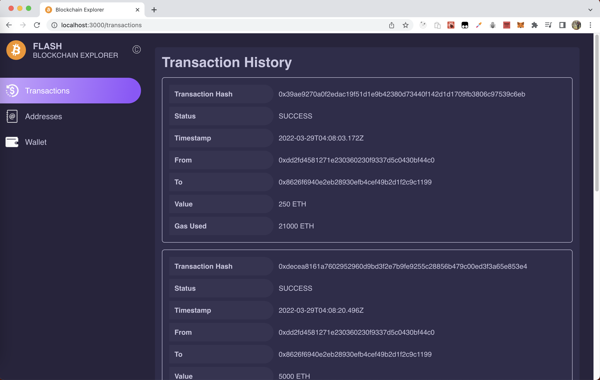
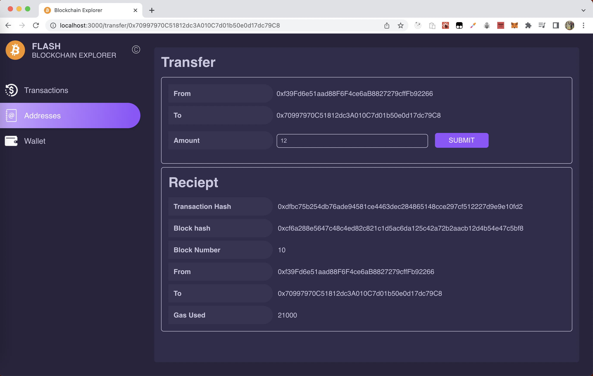
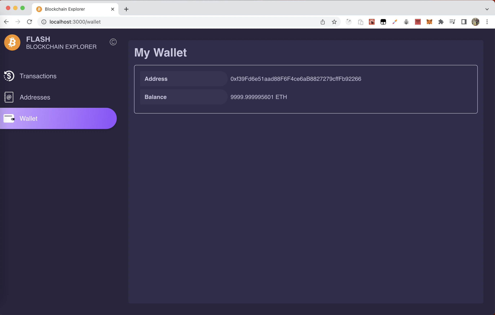

## Flash Blockchain Explorer Application
 
  Instructions :  
   

  git clone https://github.com/suryapranesh4/Flash-Blockchain-Explorer.git  
  cd Flash-Blockchain-Explorer  
  npm install  
  npm start  
  
  View blockchain explorer application in the browser : localhost:3000
  
  
The Application includes UI for transactions, block node addresses with transfer, transfer receipt and wallet details

## Screenshot of the application

#### Transaction history component:  
  

#### Transfer and Receipt component :  
  

#### Wallet component :  
  
